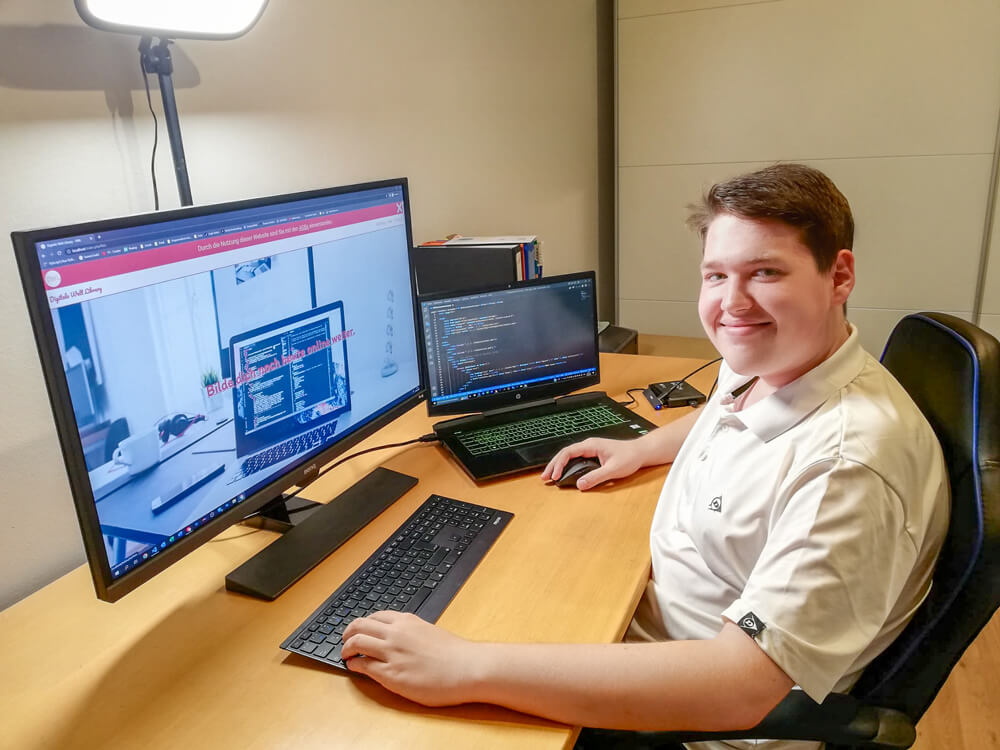

<article
  style="
    display: flex;
    gap: 1rem;
    padding: 1rem;
    border-radius: 10px;
    background-color: #f0f0f0;
    align-items: center;
    box-shadow: 0 4px 8px rgba(0, 0, 0, 0.1);
  "
>
  
  <section>
    

      <h1 style="font-size: 25px; padding: 0; margin: 0; text-wrap: pretty">
        👋 Hi, I am
        Raphael
        Holzer
      </h1>
      

        web developer, web designer, youtuber and digital artist from 📍
        Austria
      

    

    

      I am a passionate content creator and web developer, dedicated to bringing
      digital visions to life. My focus is
      on creating
      engaging web experiences
      and
      crafting compelling digital content.
      I also enjoy
       consulting and providing training 
      in various aspects of the digital world. I
        love sharing my knowledge and helping others vigate the exciting landscape of technology.
    

    

      <a
        href="https://www.founder.digitaleweltlibrary.at/"
        target="_blank"
        style="
          padding: 5px;
          text-decoration: none;
          border-radius: 10px;
          color: black;
          border: #c2c2c2 1px solid;
        "
        >🌐 Portfolio</a
      >
      <a
        href="https://www.links.digitaleweltlibrary.at/"
        target="_blank"
        style="
          padding: 5px;
          text-decoration: none;
          border-radius: 10px;
          color: black;
          border: #c2c2c2 1px solid;
        "
        >🔗 Links</a
      >
      <a
        href="https://www.digitaleweltlibrary.at/"
        target="_blank"
        style="
          padding: 5px;
          text-decoration: none;
          border-radius: 10px;
          color: black;
          border: #c2c2c2 1px solid;
        "
        >🌐 DWL</a
      >
      <a
        href="https://www.youtube.com/@DigitaleWeltLibrary"
        target="_blank"
        style="
          padding: 5px;
          text-decoration: none;
          border-radius: 10px;
          color: black;
          border: #c2c2c2 1px solid;
        "
        >▷ YouTube</a
      >
      <a
        href="https://www.frontendmentor.io/profile/DigitaleWeltLibrary"
        target="_blank"
        style="
          padding: 5px;
          text-decoration: none;
          border-radius: 10px;
          color: black;
          border: #c2c2c2 1px solid;
        "
        >✏️ Frontend Mentor</a
      >
      <a
        href="https://www.codewars.com/users/DigitaleWeltLibrary"
        target="_blank"
        style="
          padding: 5px;
          text-decoration: none;
          border-radius: 10px;
          color: black;
          border: #c2c2c2 1px solid;
        "
        >💻 Codewars</a
      >
      <a
        href="https://www.founder.digitaleweltlibrary.at/#contact"
        target="_blank"
        style="
          padding: 5px;
          text-decoration: none;
          border-radius: 10px;
          color: black;
          border: #c2c2c2 1px solid;
        "
        >✉️ contact</a
      >
    

  </section>
</article>

<!-- <article
  style="
    margin-top: 10px;
    display: grid;
    gap: 1rem;
    padding: 1.5rem;
    border-radius: 10px;
    background-color: #f0f0f0;
    align-items: center;
    box-shadow: 0 4px 8px rgba(0, 0, 0, 0.1);
    grid-template-columns: repeat(auto-fit, minmax(250px, 1fr));
  "
>
  

    

      
      <h2 style="font-size: 20px">Web Development & Design</h2>
    

    

      I design and develop modern, responsive, and user-centric websites and web
      applications precisely tailored to your specific needs.
    

  

  

    

      
      <h2 style="font-size: 20px">Content Creation & Digital Marketing</h2>
    

    

      I optimize websites for search engines, boosting their visibility and
      rankings. I also create compelling content to ensure your site is found
      and attracts quality traffic.
    

  

  

    

      
      <h2 style="font-size: 20px">IT & Programming Education</h2>
    

    

      I demystify technical subjects by providing clear, concise, and practical
      explanations. I create educational resources that transform complex
      concepts into understandable knowledge.
    

  

  

    

      
      <h2 style="font-size: 20px">Efficiency & Automation</h2>
    

    

      I identify bottlenecks and implement digital tools and processes. My goal
      is to streamline workflows, enhance productivity, and optimize operations.
    

  

</article>
 -->